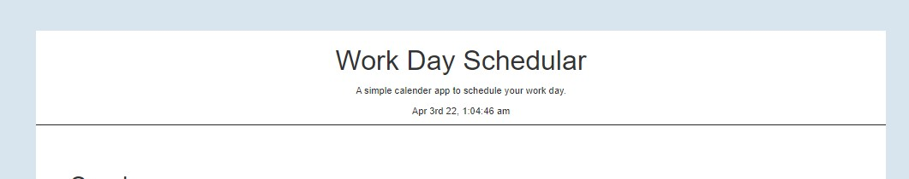
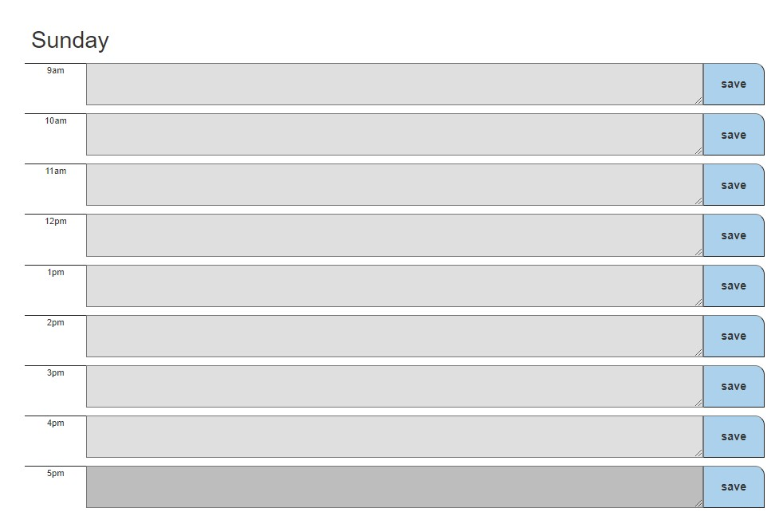
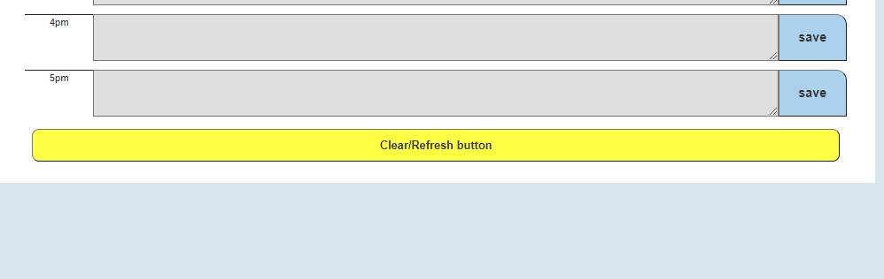
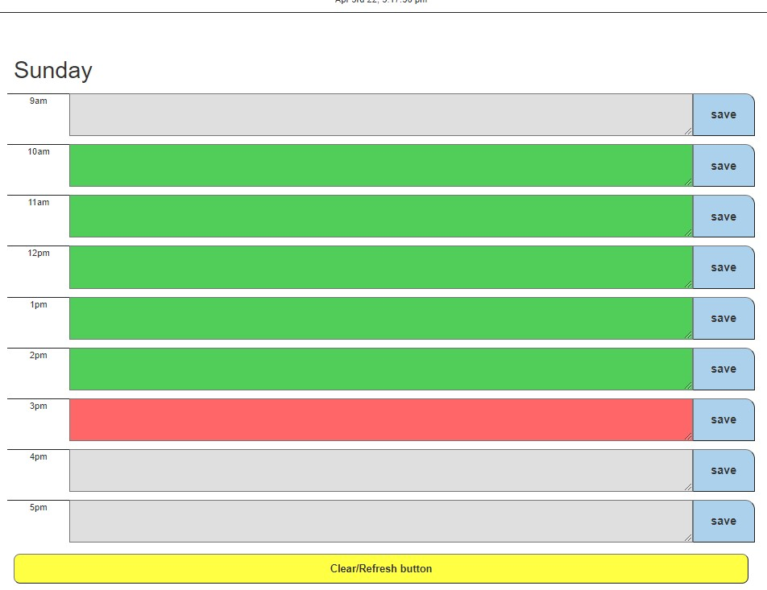

# Day-schedular-html-css-java

Welcome to The Dayly schedular, you can enter your daily tasks within 
the textboxes and have them saved in the browser.

You may always return to this schedular and continue to update your tasks.

The textboxes will change based on the hour:
-
```bash
-Past hour: Grey color
-Present hour: Red color
-Future hour: Green hour
```

## Built with: 
```bash
-Html
-CSS
-Java
```

## What day and time is it.

## Update your task.

## Clear the page for new tasks.

## Clear the page for new tasks.

## Website links

[Github](https://github.com/ashokunb)

[LinkedIn](https://www.linkedin.com/in/ambroseshokunbi/)